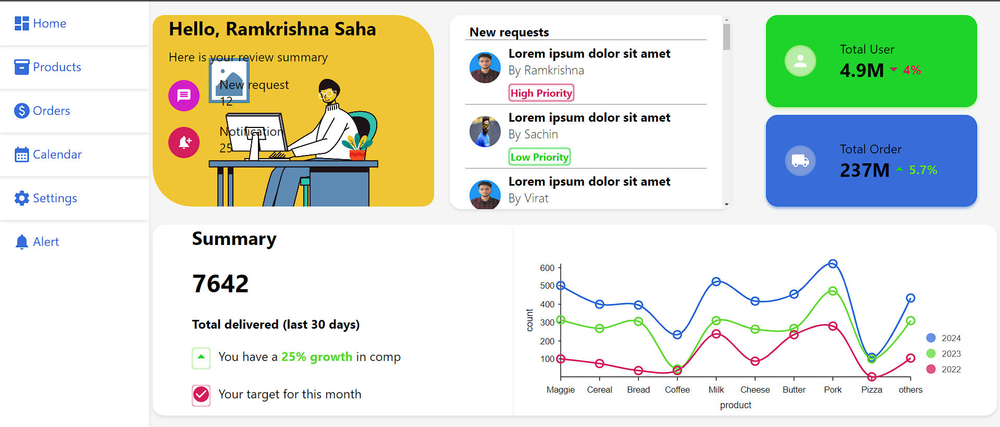
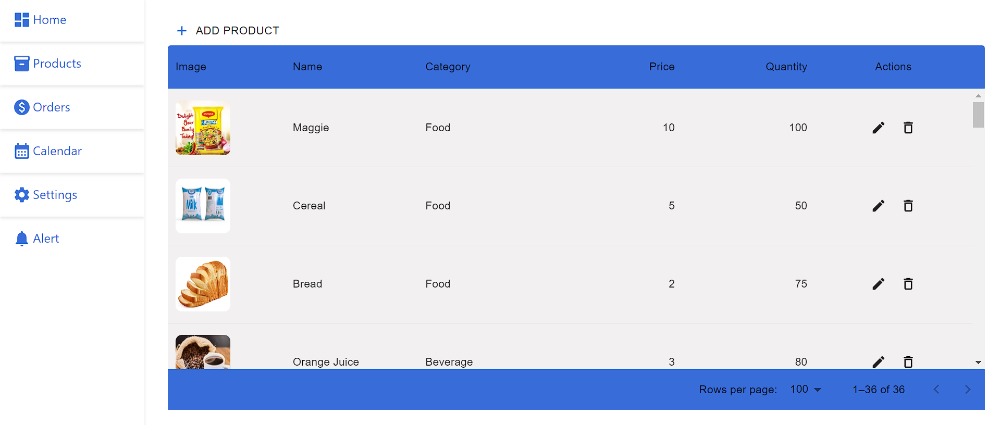
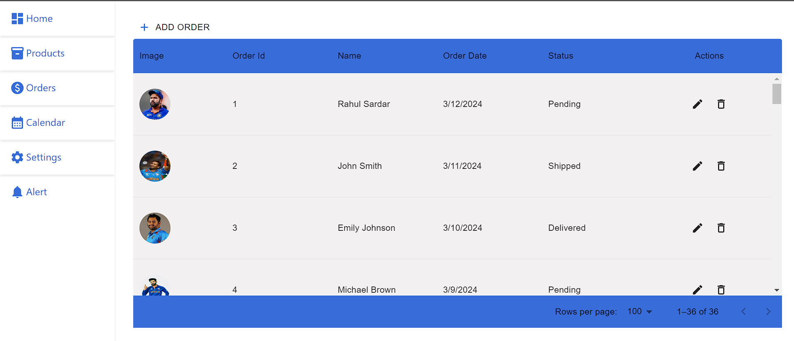
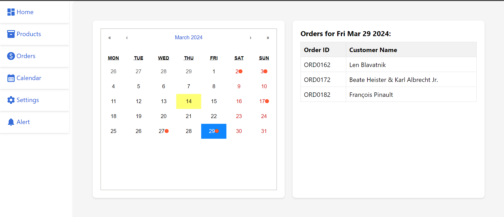

# ERP System Frontend

This repository contains the frontend code for the ERP (Enterprise Resource Planning) system. It provides a simplified interface for managing basic business operations efficiently, including product and order management, as well as a calendar view for tracking orders.

The frontend is built using React.js and includes features such as a dashboard summary, product management, order management, and an orders calendar view.

## Live Demo

The frontend application is deployed and can be accessed live at: [https://erpsystem7.netlify.app](https://erpsystem7.netlify.app)

## Prerequisites

To run this frontend application locally, you need to have the following installed:

- Node.js (at least version 12.x)
- npm (Node Package Manager)

## Getting Started

To get a local copy of the frontend application up and running, follow these steps:

1. Clone this repository to your local machine:

```bash
git clone https://github.com/ramkrishna07/erp_system.git
```

2. Navigate to the project directory:

```bash
cd erp_system
```

3. Install the required dependencies using npm:

```bash
npm install
```

## Running the Application

Once the dependencies are installed, you can start the frontend application locally by running the following command:

```bash
npm start
```

This will start the development server and open the application in your default web browser. If it doesn't open automatically, you can access the application at [http://localhost:3000](http://localhost:3000).

## Usage

Once the application is running, you can interact with it using your web browser. Here's a brief overview of the available features:

- **Dashboard:** Provides a summary of key metrics and features, with links to navigate to the Products and Orders management pages.
- **Products Management:** Allows you to view, add, edit, and delete products.
- **Orders Management:** Allows you to view a list of orders, with options to view details, update status, and delete orders.
- **Orders Calendar View:** Displays orders on their expected delivery dates in a calendar format, with the ability to click on a date to view orders due for delivery that day.


## Screenshots

Here are some screenshots of the ERP system frontend:

### Dashboard


### Products Management


### Orders Management


### Orders Calendar View



## Contributing

If you'd like to contribute to the development of this frontend application, please follow these steps:

1. Fork this repository on GitHub.
2. Create a new branch for your feature or bug fix: `git checkout -b feature-name`.
3. Make your changes and commit them: `git commit -m "Description of changes"`.
4. Push your changes to your fork: `git push origin feature-name`.
5. Submit a pull request to the main repository.

---

Feel free to customize this README document further based on your specific project details and requirements. Ensure that the instructions are clear and concise to help users understand how to set up and interact with your frontend application effectively.